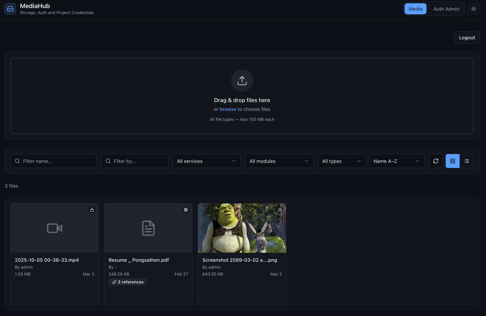
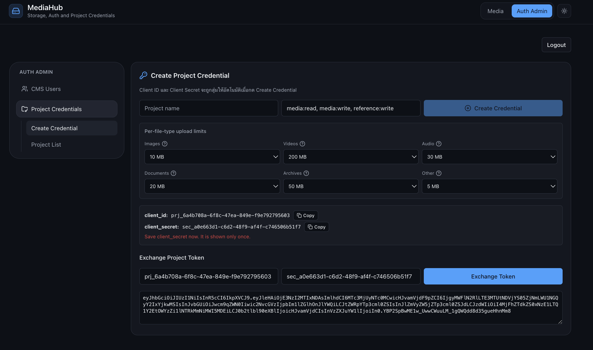
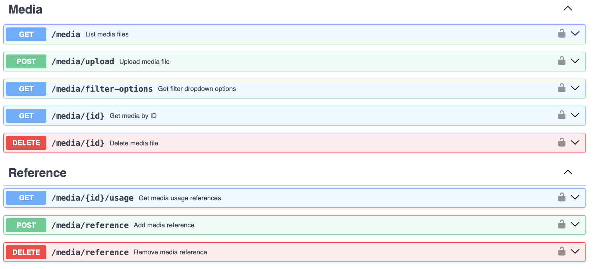
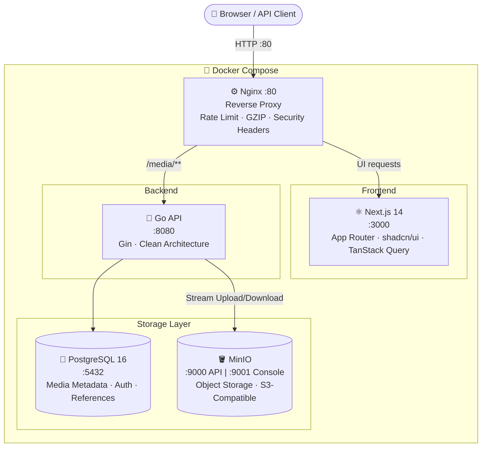
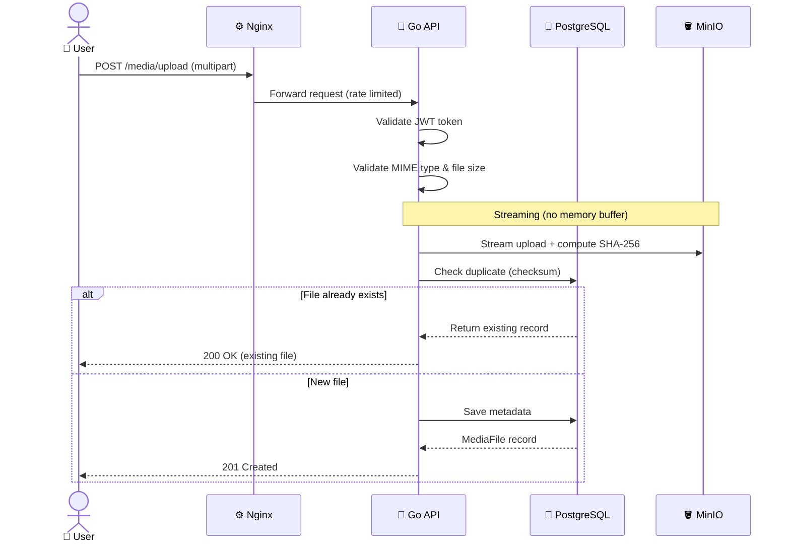
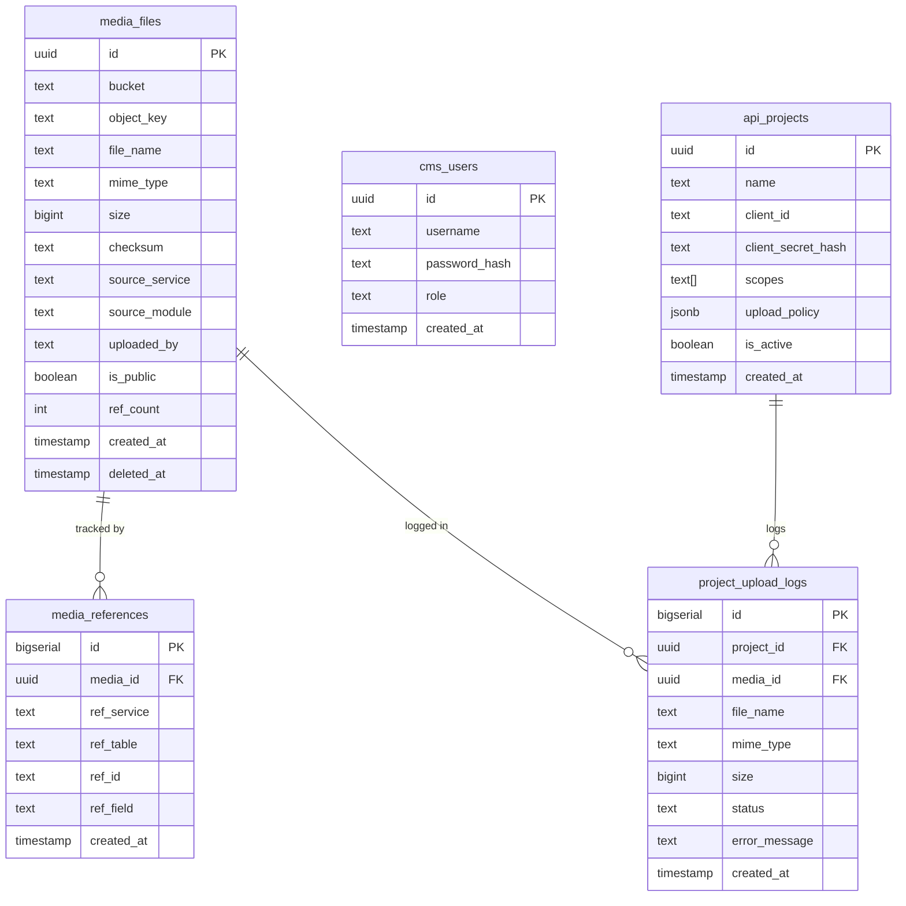
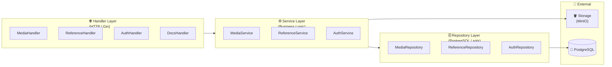
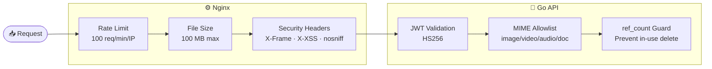

<div align="center">

# 🗂️ MediaHub

**Production-grade Media Storage & Library System**

[](https://go.dev/)
[](https://nextjs.org/)
[](https://www.postgresql.org/)
[](https://min.io/)
[](https://www.docker.com/)
[](LICENSE)

ระบบจัดการและจัดเก็บไฟล์มีเดีย รองรับ S3-compatible object storage พร้อม Web UI สำหรับการจัดการไฟล์ รูปภาพ วิดีโอ และเอกสารในองค์กร

[Quick Start](#-quick-start) · [API Reference](#-api-reference) · [Architecture](#-architecture) · [Configuration](#-configuration)

</div>

---

## ✨ Features

| Feature | Description |
|---------|-------------|
| 🚀 **Streaming Upload** | ไม่ buffer ในหน่วยความจำ ส่งตรงจาก client ไปยัง MinIO |
| 🔁 **SHA-256 Deduplication** | ตรวจจับไฟล์ซ้ำด้วย checksum ก่อนบันทึก |
| 🔗 **Reference Tracking** | นับการใช้งานไฟล์ข้ามระบบ ป้องกันการลบไฟล์ที่ยังใช้งานอยู่ |
| 🔐 **Signed URLs** | URL ชั่วคราวสำหรับไฟล์ private (หมดอายุอัตโนมัติ) |
| 🧹 **Auto Cleanup** | ลบไฟล์ที่ไม่มีการอ้างอิงอัตโนมัติทุก 1 ชั่วโมง |
| ⚡ **Rate Limiting** | จำกัด 100 req/min ต่อ IP ผ่าน Nginx |
| 👤 **JWT Auth** | HS256 authentication สำหรับผู้ใช้ และ Client Credentials สำหรับ service |
| 📋 **Upload Audit Logs** | บันทึก log การอัพโหลดของแต่ละ API Project |
| 📄 **Swagger UI** | Interactive API documentation พร้อมใช้งาน |

---

## 📸 Screenshots

### Media Library — หน้าหลักแสดง Grid ของไฟล์ทั้งหมด


### Auth & API Project Management — จัดการ API Projects และ Credentials



### Swagger UI — Interactive API Documentation



---

## 🏗️ Architecture

### System Overview



### Request Flow: File Upload



### Database Schema



### Clean Architecture (Backend)



---

## 🚀 Quick Start

### Prerequisites

- **Docker & Docker Compose v2+** (required)
- Go 1.21 + Node 20 (optional, for local dev)

### 1. Clone & Setup

```bash
git clone <your-repo-url>
cd Media

# Copy env and set JWT secret
cp .env.example .env
```

แก้ไข `.env` ตั้งค่า `JWT_SECRET` ให้เป็น string สุ่มที่ปลอดภัย (อย่างน้อย 32 ตัวอักษร):

```env
JWT_SECRET=your-super-secret-key-at-least-32-chars
```

### 2. Start All Services

```bash
docker compose up -d
```

รอ health check ผ่านแล้วเข้าใช้งานได้เลย

### 3. Access Services

| Service | URL | Default Credentials |
|---------|-----|---------------------|
| 🖥️ **Frontend** | http://localhost | — |
| 🔵 **API** | http://localhost/media | — |
| 📄 **Swagger UI** | http://localhost:8080/docs/swagger | — |
| 📋 **OpenAPI Spec** | http://localhost:8080/docs/openapi.yaml | — |
| 🪣 **MinIO Console** | http://localhost:9001 | `minioadmin` / `minioadmin` |

### 4. Login (Default Admin)

```bash
curl -X POST http://localhost:8080/auth/login \
  -H "Content-Type: application/json" \
  -d '{"username": "admin", "password": "admin"}'
```

> ⚠️ เปลี่ยน password admin ทันทีหลัง deploy ครั้งแรก

---

## 📡 API Reference

ทุก endpoint ต้องส่ง `Authorization: Bearer <token>` (ยกเว้น health check และ auth)

### Authentication

```http
POST /auth/login
Content-Type: application/json

{
  "username": "admin",
  "password": "admin"
}
```

**Response:**
```json
{
  "token": "eyJhbGci...",
  "expires_at": "2026-01-02T00:00:00Z"
}
```

```http
POST /auth/project-token
Content-Type: application/json

{
  "client_id": "project-client-id",
  "client_secret": "project-secret"
}
```

---

### Upload File

```http
POST /media/upload
Authorization: Bearer <token>
Content-Type: multipart/form-data

file            = <binary>
source_service  = "post-service"    (optional)
source_module   = "avatar"          (optional)
is_public       = "true" | "false"
```

**Response 201:**
```json
{
  "id": "550e8400-e29b-41d4-a716-446655440000",
  "file_name": "photo.jpg",
  "mime_type": "image/jpeg",
  "size": 204800,
  "checksum": "sha256:abc123...",
  "is_public": true,
  "url": "http://localhost:9000/media/...",
  "ref_count": 0,
  "created_at": "2026-01-01T00:00:00Z"
}
```

> ℹ️ ถ้าอัพโหลดไฟล์ซ้ำ (checksum เดิม) จะ return ไฟล์เดิมโดยไม่เสียพื้นที่

---

### List Files

```http
GET /media?page=1&limit=20&type=image&search=logo&sort_by=created_at&sort_dir=desc
Authorization: Bearer <token>
```

| Parameter | Type | Description |
|-----------|------|-------------|
| `page` | int | หน้าที่ต้องการ (default: 1) |
| `limit` | int | จำนวนต่อหน้า (default: 20, max: 100) |
| `type` | string | ประเภทไฟล์: `image`, `video`, `audio`, `document`, `archive` |
| `search` | string | ค้นหาจากชื่อไฟล์ |
| `source_service` | string | กรองตาม service |
| `sort_by` | string | `created_at`, `size`, `file_name` |
| `sort_dir` | string | `asc`, `desc` |

---

### Get / Delete File

```http
GET    /media/:id
DELETE /media/:id
```

> ℹ️ DELETE จะ return `409 Conflict` ถ้า `ref_count > 0`

---

### Reference Tracking

เพิ่มการอ้างอิง (ป้องกันการลบไฟล์):
```http
POST /media/reference
Authorization: Bearer <token>
Content-Type: application/json

{
  "media_id":    "550e8400-...",
  "ref_service": "post-service",
  "ref_table":   "posts",
  "ref_id":      "123",
  "ref_field":   "cover_image"
}
```

ลบการอ้างอิง:
```http
DELETE /media/reference
```

ตรวจสอบการใช้งาน:
```http
GET /media/:id/usage
```
```json
{
  "media_id": "550e8400-...",
  "ref_count": 2,
  "references": [
    {
      "ref_service": "post-service",
      "ref_table": "posts",
      "ref_id": "123",
      "ref_field": "cover_image"
    }
  ]
}
```

---

### Health Check

```http
GET /health
→ 200 { "status": "ok" }
```

---

## ⚙️ Configuration

### Environment Variables

**Server**
| Variable | Default | Description |
|----------|---------|-------------|
| `SERVER_PORT` | `8080` | API port |
| `GIN_MODE` | `debug` | `debug` หรือ `release` |

**Database**
| Variable | Default | Description |
|----------|---------|-------------|
| `DB_HOST` | `localhost` | PostgreSQL host |
| `DB_PORT` | `5432` | PostgreSQL port |
| `DB_USER` | `postgres` | Database user |
| `DB_PASSWORD` | `postgres` | Database password |
| `DB_NAME` | `media_cms` | Database name |
| `DB_SSLMODE` | `disable` | SSL mode (`disable`/`require`) |
| `DB_MAX_OPEN_CONNS` | `25` | Connection pool size |

**MinIO / Object Storage**
| Variable | Default | Description |
|----------|---------|-------------|
| `MINIO_ENDPOINT` | `localhost:9000` | MinIO API endpoint |
| `MINIO_ACCESS_KEY` | `minioadmin` | Access key |
| `MINIO_SECRET_KEY` | `minioadmin` | Secret key |
| `MINIO_DEFAULT_BUCKET` | `media` | Bucket ที่ใช้ |
| `MINIO_PUBLIC_ENDPOINT` | `http://localhost:9000` | URL สำหรับ public files |
| `MINIO_SIGNED_URL_EXPIRY` | `1h` | อายุ signed URL ของ private files |

**Auth & Security**
| Variable | Default | Description |
|----------|---------|-------------|
| `JWT_SECRET` | — | **Required** HS256 signing key |
| `JWT_EXPIRY` | `24h` | Token expiry |
| `AUTH_REQUIRED` | `false` | บังคับ auth บน media routes |

**Upload**
| Variable | Default | Description |
|----------|---------|-------------|
| `UPLOAD_MAX_SIZE_BYTES` | `104857600` | ขนาดไฟล์สูงสุด (100 MB) |

---

## 🔒 Security



- **JWT HS256** บน media routes ทั้งหมด
- **MIME type allowlist** ป้องกันไฟล์อันตราย
- **File size enforcement** ทั้ง nginx และ application layer
- **`ref_count > 0`** บล็อคการลบไฟล์ที่ยังถูกใช้งาน
- **Signed URL expiration** สำหรับ private files
- **Per-IP rate limiting** ผ่าน Nginx
- **Non-root Docker containers**
- **Security headers** ผ่าน nginx

---

## 🛠️ Local Development

### Backend Only

```bash
# Start dependencies
docker compose up -d postgres minio

# Run Go API with live reload
cd backend
go run ./cmd/main.go
```

### Frontend Only

```bash
cd frontend
npm install

# Set API URL
echo "NEXT_PUBLIC_API_URL=http://localhost:8080" > .env.local

npm run dev
```

### Full Dev Mode (Hot Reload)

```bash
docker compose -f docker-compose.yml -f docker-compose.dev.yml up -d
```

### Database Migrations

Migrations run automatically on first `docker compose up`. For manual apply:

```bash
psql -h localhost -U postgres -d media_cms -f backend/migrations/001_init.sql
```

Migration files:
```
backend/migrations/
├── 001_init.sql              ← Core schema + triggers
├── 002_performance_indexes.sql ← GIN indexes, pg_trgm
├── 003_auth.sql              ← cms_users, api_projects
├── 004_project_upload_policy.sql ← Upload limits per project
└── 005_project_upload_logs.sql   ← Audit log table
```

---

## 📦 Project Structure

```
Media/
├── backend/
│   ├── cmd/
│   │   └── main.go              ← Entry point, DI, router, cron
│   ├── internal/
│   │   ├── config/              ← Env-based configuration
│   │   ├── model/               ← Domain structs
│   │   ├── repository/          ← PostgreSQL queries (sqlx)
│   │   ├── service/             ← Business logic
│   │   ├── handler/             ← HTTP handlers (Gin)
│   │   ├── storage/             ← ObjectStorage interface + MinIO
│   │   ├── middleware/          ← JWT, logging, rate limit
│   │   └── utils/               ← Checksum, MIME validation
│   └── migrations/              ← SQL migration files
│
├── frontend/
│   ├── app/                     ← Next.js App Router pages
│   ├── components/              ← React components
│   ├── hooks/                   ← Custom hooks (TanStack Query)
│   ├── lib/                     ← API client, utilities
│   └── types/                   ← TypeScript interfaces
│
├── nginx/
│   └── nginx.conf               ← Reverse proxy config
│
├── docker-compose.yml           ← Production
├── docker-compose.dev.yml       ← Development overrides
└── .env.example                 ← Environment template
```

---

## 🚢 Production Checklist

- [ ] ตั้งค่า `JWT_SECRET` ให้แข็งแกร่ง (32+ random characters)
- [ ] เปลี่ยน `GIN_MODE=release`
- [ ] เปลี่ยน MinIO credentials ใหม่ (ไม่ใช้ default)
- [ ] ตั้งค่า `DB_SSLMODE=require` พร้อม TLS certs
- [ ] ตั้งค่า `AUTH_REQUIRED=true`
- [ ] กำหนด MinIO bucket policy สำหรับ public bucket
- [ ] ชี้ `MINIO_PUBLIC_ENDPOINT` ไปยัง CDN
- [ ] Configure nginx กับ TLS (Let's Encrypt)
- [ ] ตั้งค่า PostgreSQL backups
- [ ] ติดตามด้วย Prometheus / Grafana

---

## 📝 License

Non-Commercial Open Source License — see [LICENSE](LICENSE) for details.

---

<div align="center">
Made with ❤️ using Go · Next.js · PostgreSQL · MinIO
</div>
